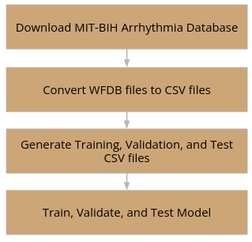

# ECG Classification Using the MIT-BIH Arrhythmia Database

> Benzon Carlitos Salazar
> CS732 Final Project
> December 11, 2023

## Introduction

The exploration of classification algorithms on ECG data to detect heart disease lies in the ability of classification 
algorithms to analyze and interpret complex patterns within the ECG signals. Several compelling motivations drive this 
pursuit: firstly, classification algorithms enable the early identification of heart abnormalities and arrhythmias by 
discerning patterns indicative of various heart conditions. This capability is crucial for timely intervention and 
effective management of cardiovascular health. Additionally, the manual analysis of ECG signals is not only time-
consuming but also demands specialized expertise, two important things I unfortunately do not have. Classification 
algorithms automate this process, providing an efficient and scalable approach to analyzing extensive volumes of ECG 
data, offering a practical solution for the challenges posed by manual ECG reading.

Furthermore, these algorithms offer an objective and consistent analysis of ECG data, mitigating the potential for human 
error or subjectivity in results interpretation. This consistency is vital for reliable and reproducible diagnostics. 
Lastly, different classification algorithms can be tailored to identify specific types of arrhythmias or abnormalities, 
enhancing the diagnostic capacity of the entire system and providing detailed insights into the nature of the heart 
condition.

## Prior Works

In 2022, Darmawahyuni et al. proposed a one-dimensional Convolutional Neural Network (1D-CNN) for ECG rhythm and beat 
classification. Notably, their approach simplified the classification process by employing a single deep learning 
architecture for both rhythm and beat features, achieving high accuracy across nine rhythm and fifteen beat classes. 
The low computational requirements of the 1D-CNN model enhance its suitability for real-time and cost-effective 
applications in ECG devices [1].

In 2023, Ramkumar et al. presented an ensemble classifier for arrhythmia detection, emphasizing the significance of 
their AD-Ensemble SVM-NB-RF method. The study aimed to create a universal model applicable to the general population, 
employing ensemble classifiers (SVMs, Naive Bayes, and random forest) for arrhythmia detection. The two-stage arrhythmia 
classification utilized Residual Exemplars of Local Binary Pattern (RELBP) for pre-processing ECG signals [2].

In 2019, Alfaras et al. introduced a fast machine learning model for ECG-based heartbeat classification and arrhythmia 
detection. Their proposed ensemble of Echo State Networks (ESNs) addressed the challenge of long computation times for 
classifiers, showcasing advantages in speed and memory over traditional methods. Recurrent connections and parallel 
computing architecture were key components of their methodology [3].

## Project Aims



## Experiments

1. Performance Evaluation: Assess the model's accuracy, precision, recall, and F1-score on the validation set.
2. Hyperparameter Tuning: Fine-tune model parameters to optimize performance.
3. Cross-Validation: Conduct cross-validation to ensure robustness of the chosen approach.
4. Comparison with Prior Works: Compare the performance of our model with existing studies in ECG classification.

## Project Timeline

1. Understand the dataset -- **DONE**
	* Download and thoroughly understand the ECG-ID Database.
	* Examine the data structure, features, and labels.
	* Identify any missing or noisy data.
2. Research -- **DONE**
	* Read relevant literature on ECG signal classification
	* Identify potential algorithms and techniques suitable for the project.
3. Data Processing -- **DONE**
	* Handle missing data, if any.
	* Normalize and standardize features.
	* Explore techniques for handling imbalanced classes.
4. Feature Extraction -- **DONE**
	* Extract relevant features from ECG signals.
	* Consider time-domain and frequency-domain features.
5. Model Selection -- **DONE**
	* Choose a suitable classification algorithm.
	* Divide the dataset into training and testing sets.
6. Model Training -- **DONE**
	* Train your chosen model using the training set.
	* Experiment with hyperparameter tuning to improve performance.
7. Evaluation and Fine-Tuning: -- **DONE**
	* Evaluate the model on the testing set.
	* Fine-tune the model based on performance.
	* Consider using techniques like cross-validation.
8. Prepare Presentation -- **DONE**
	* Create slides summarizing the project:
		* Introduction
		* Prior works
		* Dataset overview
		* Methodology
		* Results
		* Challenges faced
		* Future work
		* Conclusion
9. Submission
	* Finalize Model:  -- **DONE**
		* Make final adjustments to the model based on any insights.
		* Record presentation, ensuring clarity and conciseness.
	* Prepare Submission: -- **DONE**
		* Finalize the project report.
		* Ensure all files are organized and ready for submission.
	* Submit: -- **DONE**
		* Submit project before the 6pm deadline.

## Conclusion

### Challenges Faced

The implementation of the ECG data classification project encountered several challenges throughout its development:

Firstly, the pre-processing phase posed a significant hurdle due to the unfamiliarity with processing waveform signals. 
While having extensive experience with unstructured text and tabular data, dealing with the intricacies of waveform 
signals proved time-consuming.

Secondly, the inherently noisy nature of ECG data complicated the accurate identification of each PQRST wave. To address 
this challenge, a strategic decision was made to switch to the MIT-BIH Arrhythmia dataset, renowned for its cleanliness 
and comprehensiveness. This change aimed to ensure the reliability and accuracy of the dataset, laying a robust 
foundation for subsequent analyses.

A hardware limitation further impacted the project. The initial intention was to implement TensorFlow’s DNNClassifier, a 
Deep Neural Network Classifier. However, due to the absence of the necessary hardware and GPUs for running the 
classifier on large amounts of data, an alternative solution was sought. Consequently, the Multilayer Perceptron (MLP) 
Classifier was adopted, ensuring computational feasibility within the existing hardware constraints.

### Potential Future Work

Several avenues for potential future work and enhancements to the project includes;

Firstly, incorporating both TensorFlow and PyTorch into the project can open doors to advanced deep learning techniques 
and models. The unique strengths and features of each framework offer opportunities for exploring more sophisticated 
algorithms, potentially leading to improved model performance.

Expanding the dataset from half-hour ECG readings to a more prolonged duration, such as an hour, emerges as a promising 
avenue. This extension provides an opportunity to capture additional temporal patterns and variations in cardiac 
activity, contributing to a more comprehensive understanding of heart rhythms and potentially enhancing the model's 
ability to generalize.

Considering the contemporary context, updating the dataset to include records from 2020 onwards, especially those 
involving patients affected by COVID-19, introduces a relevant and current perspective. Analyzing ECG data from 
individuals with COVID-19 may unveil unique cardiac signatures associated with the disease, thereby contributing to a 
deeper understanding of its impact on cardiovascular health.

The implementation of ensemble learning methods, such as combining predictions from multiple models, stands out as a 
potential enhancement. Ensemble techniques often lead to improved model performance by mitigating individual model 
biases and capturing a more comprehensive representation of underlying patterns. Introducing such methods could enhance 
the robustness and generalization of the model, especially in handling diverse and complex ECG data.

### Overall Conclusion

The achieved exceptional metrics, including a remarkable accuracy of 98%, demonstrate the model's proficiency in 
accurately predicting arrhythmias from ECG data. With these metrics, there is a high level of confidence in the model's 
ability to precisely identify and classify arrhythmias. The success of the final model signifies the practical utility 
in providing reliable predictions, contributing to the field of ECG analysis, and facilitating early detection and 
intervention for cardiovascular health.

## Citations

* [1][1] Darmawahyuni, Annisa, et al. "Deep learning-based electrocardiogram rhythm and beat features for heart abnormality 
classification." PeerJ Computer Science 8 (2022): e825.
* [2][2] Ramkumar, M., et al. "Ensemble classifier fostered detection of arrhythmia using ECG data." Medical & Biological 
Engineering & Computing (2023): 1-14.

## Structure

```
|-- LICENSE
|-- README.md         <- The top-level README for developers using this project.
|-- data
|   |-- external      <- Data from third party sources.
|   |-- interim       <- Intermediate data that has been transformed.
|   |-- processed     <- The final, canonical data sets for modeling.
|   |-- raw           <- The original, immutable data dump.
|
|-- docs              <- Any documentation for this project.
|
|-- models            <- Trained and serialized models, model predictions, or model summaries.
|
|-- notebooks         <- Jupyter notebooks. Naming convention is a number (for ordering),
|                        a short `_` delimited description, e.g.
|                        `01_initial_data_exploration`.
|
|-- references        <- Data dictionaries, manuals, and all other explanatory materials.
|
|-- reports           <- Generated analysis as HTML, PDF, LaTex, etc.
|   |-- figures       <- Generated graphics and figures to be used in reporting.
|
|-- requirements.txt  <- The requirements file for reproducing the analysis environment.
|
|-- src               <- Source code for use in this project.
|   |-- __init__.py   <- Makes src a Python module.
|   |-- ...           <- Any other modules created for this project.
```

[1]: https://pubmed.ncbi.nlm.nih.gov/35174263/
[2]: https://www.springerprofessional.de/en/ensemble-classifier-fostered-detection-of-arrhythmia-using-ecg-d/25326980
[3]: https://www.researchgate.net/publication/334551374_A_Fast_Machine_Learning_Model_for_ECG-Based_Heartbeat_Classification_and_Arrhythmia_Detection
